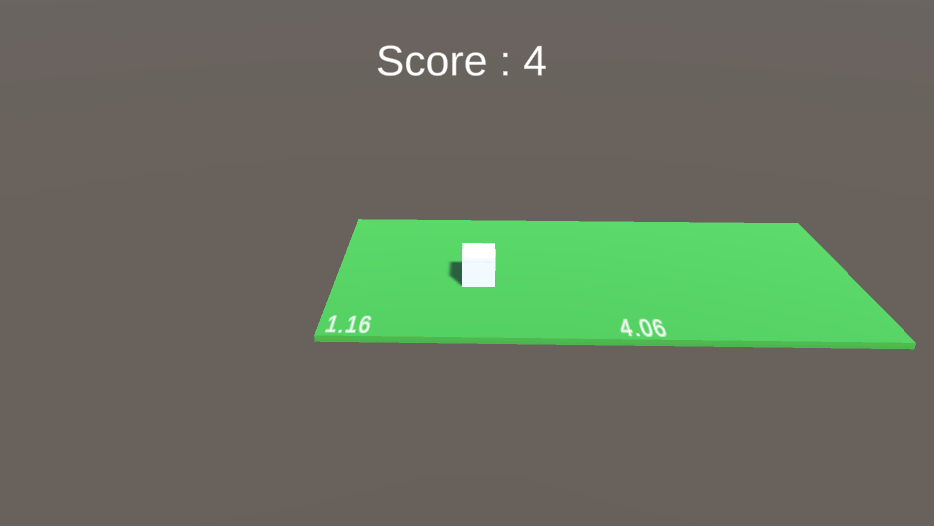

# Doofus
### A 3D Survival Game made in Unity. 
In this game you will be a player name Doofus and there will be platforms that will generate randomly to the adjacent of the previous platform. And you have to survive without falling from the platform. 

---

# Screenshots

---

### Implementation Details & Design Patterns Used 
* Used generic Singleton.
* Implemented MVC-S design pattern for the player.
* Implemented MVC-S design pattern for the platforms.
* Implemented object pooling for platforms.
* Implemented State Machine pattern for different states of platform like Initialized, OnSpawned, and Destroy.
